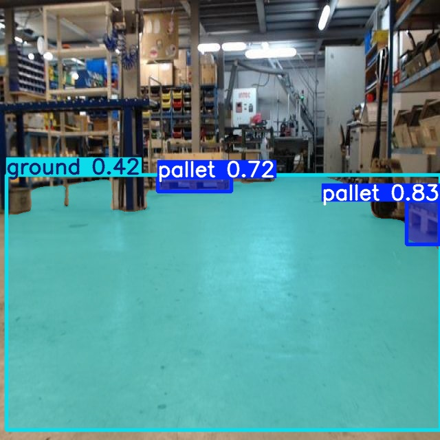

# Pallet and Ground Segmentation using YOLOv5

## Introduction

The projects consists code to run yolov5 inference by subscribing to a camera using ROS2.

## ROS2 Topics

`predict.py` subscribes to:
- topic_name: image_raw 
    - Message type: (`sensor_msgs/Image`)

`predict.py` publishes annotated images to:
- topic_name: yolov5/pred 
    - Message type: (`sensor_msgs/Image`)

`publish_image.py` publishes to:
- topic_name: image_raw 
    - Message type: (`sensor_msgs/Image`)


## Setup

Create a ROS2 workspace using
  ```sh
  mkdir -p ~/yolov5_ws/src
  cd ~/yolov5_ws/src
  ```

Clone this package
```sh
git clone https://github.com/SravanChittupalli/yolov5_ros_pkg.git
```

build the package 
```sh
colcon build
source install/local_setup.bash
```

Download weights (best.pt) from 
```
https://drive.google.com/file/d/1FvH4wM-TCqnbd_iiSzPsMutuJHCeX679/view?usp=sharing
```

(Optional) Export the weights to .onnx or .engine (tensorrt). After running the command the .engine and .onnx file should be in the same folder as the .pt folder
```sh
cd ~/yolov5_ws/src/yolov5_ros_pkg/yolov5_ros
python export.py --weights <path_to_weight_file> --include onnx engine --img 640 --device 0
```

Start the Publisher
```sh
ros2 run yolov5_ros publish_image
```

Predict Images
```sh
ros2 run yolov5_ros predict --ros-args -p weight_file:="<absolute path to weight file(.pb, .engine)>" -p data_file:="<absolute path to .yaml file>" -p show_bbox:=false
```

## Predictions on Testset

| Image 1 | Image 2 |
|--|--|
|  |  |